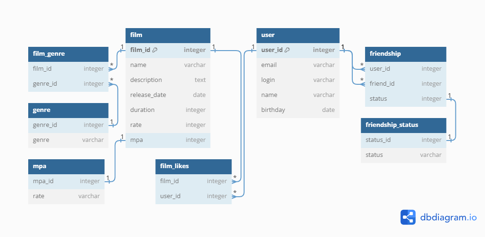

# java-filmorate
Template repository for Filmorate project.


## Examples of SQL Queries
```sql
-- Request for a list of popular films
SELECT f.name,
       COUNT(fl.user_id) AS like_count
FROM film AS f
LEFT JOIN film_likes fl ON f.film_id = fl.film_id
GROUP BY f.film_id
ORDER BY like_count DESC
LIMIT 10;

-- Request to get mutual friends of two users
SELECT u.*
FROM user AS u
JOIN friendship AS f1 ON u.user_id = f1.friend_id
WHERE f1.user_id = 1 AND f1.status = 'CONFIRMED'
      AND u.user_id IN (
          SELECT f2.friend_id
          FROM friendship AS f2
          WHERE f2.user_id = 2 AND f2.status = 'CONFIRMED'
);

-- Request to get a list of genres for a specific movie
SELECT g.genre
FROM genre AS g
JOIN film_genre fg ON g.genre_id = fg.genre_id
WHERE fg.film_id = 1; 
