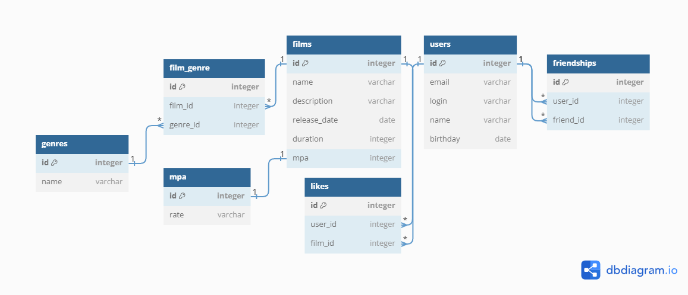

# java-filmorate
Template repository for Filmorate project.

## Examples of SQL Queries
SELECT f.*,
       m.name     AS    mpa_name,
       g.id       AS    genre_id,
       g.name     AS    genre_name,
       l.user_id  AS    user_id_like
FROM films           AS f
LEFT JOIN mpa        AS m    ON f.mpa_id = m.id
LEFT JOIN film_genre AS fg   ON f.id = fg.film_id
LEFT JOIN genres     AS g    ON fg.genre_id = g.id
LEFT JOIN likes      AS l    ON f.id = l.film_id
WHERE f.id = 1;
